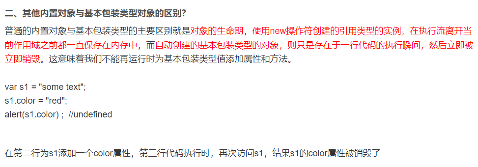

# typeScript

npm install xmzs -g 可以查看所有国内镜像源
mmp ls

npm init -y 在 Node.js 项目中用于快速初始化 package.json 文件的命令

npm i @types/node -D 安装 @types/node 这个类型定义包
在 TypeScript 项目中为原生的 Node.js 模块提供类型信息，从而增强代码的类型安全性和智能提示功能

## 运行 ts 文件

1. 安装 node 扩展 npm i typescript -g
2. 创建 index.ts
3. node init ,tsc -w 实时编译成 js 文件,node index.js
   tsconfig.json 作用
4. 安装@types/node 之后可以直接 ts-node index.ts 运行 ts 文件

## 基本数据类型

1. 顶级类型 any 类型，unknown 类型，
2. Object
3. Number,String,Boolean 内置对象，js 中的包装类型 
4. number,string,boolean,undefined,null,
5. 1,'小满'，false
6. never
<!-- unknow 类型的只能赋值给自身或者是 any 类型的变量，unknown类型无法读任何属性，方法也无法调用 -->

```JavaScript
// unknown
let xiaohu:unknown={human:false,open:()=>123}
xiaohu.human //无法读取
xiaohu.open() //无法调用
```
