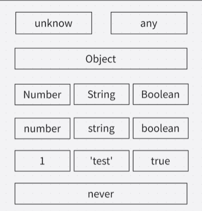

## 元组类型

<!--  -->

我的理解：规定类型和数量的数组

<!--  -->

元组类型是一个固定长度的序列类型，其中的元素可以是任意类型。元组类型的元素是通过索引访问的，索引从 0 开始。元组类型的元素是不可变的，不能被修改。元组类型的元素可以是任意类型，包括元组类型。

```JavaScript
let arr:[number,string] = [1,'string']
let arr2: readonly [number,boolean,string,undefined] = [1,true,'sring',undefined]
```

应用场景 例如定义 excel 返回的数据

```
let excel: [string, string, number, string][] = [
    ['title', 'name', 1, '123'],
    ['title', 'name', 1, '123'],
    ['title', 'name', 1, '123'],
    ['title', 'name', 1, '123'],
    ['title', 'name', 1, '123'],
]
```

## 枚举类型

### 1.数字枚举

```JavaScript

enum Types{
   Red,      //0
   Green,    //1
   BLue      //2
}

```

枚举类可以实现自增

```JavaScript
enum Types{
Red = 1,
Green,
BLue
}
这里调用Types.Green 会返回 2
```

### 2.字符串枚举

在一个字符串枚举里，每个成员都必须用字符串字面量
_字符串枚举没有自增长的行为_

### 3.异构枚举

```JavaScript
enum Types{
No = "No",
Yes = 1,
}
```

### 4.接口枚举

普通声明的枚举编译完后是个对象

### 5.const 枚举

enum 类型不能用 let var 声明，只能用 const

<!-- const 声明的枚举会被编译成常量 -->

```JavaScript
// 普通声明的枚举编译完后是个对象
var Types2;
(function (Types2) {
Types2["No"] = "No";
Types2[Types2["Yes"] = 1] = "Yes";
})(Types2 || (Types2 = {}));
```

### 6.反向映射

正向映射（ name -> value）和反向映射（ value -> name）
用法：Enum[value]->Enum[name]

```JavaScript
enum Enum {
fall
}
let a = Enum.fall;
console.log(a); //0
let nameOfA = Enum[a];
console.log(nameOfA); //fall
```

## 类型推论，类型别名

如果给变量赋值了，那么 ts 会自动给他对应的类型
如果只是创建了变量如 let str
那么 ts 会给他 any 类型

### 类型别名

type 关键字

```JavaScript
type s = string
let str:s='小虎'
```

interface A extends B{}
type s= A&B

interface 遇到重名合并，type 不合并

#### type 高级用法

<!-- 判断左边的值是否为右边类型的子类型 -->

```JavaScript
type num =1 extends number?1:2
```



## never 类型

ts 用 never 类型标识不应该存在的状态

```JavaScript
type A =string & number
// 返回never的函数必须存在无法达到的终点
// 因为必定抛出异常，所以 error 将不会有返回值
function error(message: string): never {
    throw new Error(message);
}

// 因为存在死循环，所以 loop 将不会有返回值
function loop(): never {
    while (true) {
    }
}
```

用处 1.switch 中的兜底逻辑

```JavaScript
type A = '小满' | '大满' | '超大满'

function isXiaoMan(value:A) {
   switch (value) {
       case "小满":
           break
       case "大满":
          break
       case "超大满":
          break
       default:
          //是用于场景兜底逻辑
          const error:never = value; // STAR
          return error
   }
}
如果只添加A的类型，不修改switch结构，由于never是最底层的类型，不能被赋予其他类型的值，那么error:never = value;会报错，用来兜底提示
```
